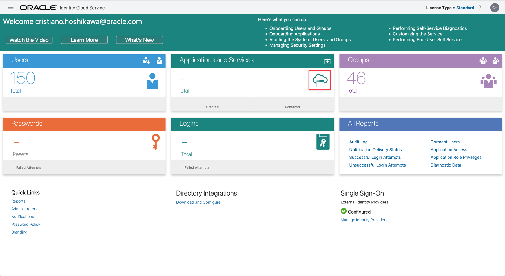
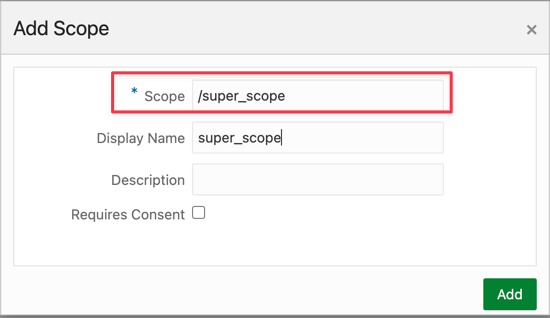
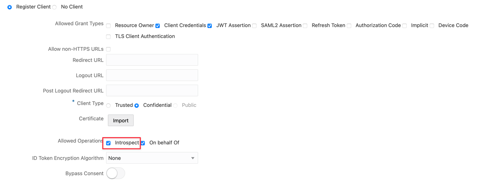

# Learn how to use Oracle Cloud API Gateway to expose OCI Streaming with other Authorization Methods

## Introduction

We often need our applications to consume OCI REST services. There are several ways to guarantee security between components, ensuring that the application can authenticate securely to the backend service.

Most of the time, this task is native within the Oracle Cloud, as there are several ways to secure the network and access to existing services. Just a few settings and you're done.

However, there are cases where the application may offer additional security and connectivity requirements.

The use case of this material meets a very common need in the hybrid or multi-cloud scenario (on-premises connected to the Oracle cloud, or Oracle cloud connected to another cloud).

Let's present the following scenario:

- Application on an on-premises network connected to Oracle Cloud through Fast-Connect/VPN
- Application needs to consume an OCI Streaming service
- OCI service does not have an authentication mechanism that meets the application consumer's possibilities
- Application needs to authenticate using OAuth2 to be able to access the service securely

Therefore, the material provides the following solution:

- Configure the Oracle IDCS cloud's own Identity Provider to authenticate through OAuth2
- Configure OCI API Gateway to integrate with IDCS to authenticate via an obtained token
- Code an fn to produce the Authentication for the OCI Streaming (**draft-cavage-http-signatures-08 method**)
- Create groups and policies to limit access to cloud resources
- Deliver an Identity Provider that allows you to pass the Client ID and Secret ID and obtain an authentication token
- Deliver a functional API Gateway REST service that authenticates through the obtained token and provides the consumer to use the Streaming Services

>**Note**: The **OCI fn** code can be downloaded [here](./files/OAuthOCIService-fn.zip)

## Objectives

- Allow an external application to consume REST services with OAuth2 authentication
- Provide an OAuth2 authentication service on OCI
- Configure OCI API Gateway and fn to run OCI services via a token

## Prerequisites

- An OCI API Gateway instance created and exposed to the Internet, see [Creating Your First API Gateway In The Oracle Cloud](https://blogs.oracle.com/developers/post/creating-your-first-api-gateway-in-the-oracle-cloud).
- Network Connectivity between OCI API Gateway, fn and OCI PaaS Resource
    - VCN/Subnets
    - Security List
    - Nat Gateway/Internet Gateway
    - Public/Private Networks
- Knowledge with the
    - OCI Functions
    - OCI REST API to code a call for the OCI Service

## Task 1: Configure OAuth2 with IDCS

### Obtain the OCI API Gateway parameters

Let's start to configure the OAuth2 mechanism. We need to integrate your OCI API Gateway instance to an Identity Provider, in this example, we will configure the IDCS from Oracle Cloud to be these identity provider.

Go to the OCI API Gateway Instance and copy your hostname. This information will be used in your IDCS resource server configuration in the next step.

### Create a Resource Application

Now we need to create an OAuth2 authorizer for your application.
We can do it with the IDCS in Oracle Cloud.

In the OCI Console, go to "Identity & Security" and select "Federation".

Now click in the "OracleIdentityCloudSevice" link.

And click in the link for your IDCS instance.

Now, we will create 2 applications. Click in the Applications and Services option.

In the Applications, click the Add button

Select "Confidential Application" to start to configure your Resource Server.

Now we will configure the first application. Put a name in your resource server application and click Next.

Skip this step. We need to configure the resource only.

Now, put your OCI API Gateway hostname obtained in the last step

Click in the Add Scope button and fill with a scope information.

Verify your scope information and click Next 2 times and finally click Finish.

Activate your application.

### Create a Client Application

In the Applications, click the Add button

Select "Confidential Application" to start to configure your Resource Server.

Put a name for your application and click Next button

Select "Configure the application as a cliente now" to enable the configurations for your client application.
After this, you will see the parameters.

Now, select "Client Credentials" and "JWT Assertion" options and "On behalf of". Don't  click Next yet.

>**Note:** If you want to validate OAuth2 in your function code, you MUST set Introspect flag. This will enable the /oauth2/v1/introspect IDCS REST API Service

Roll down the screen and click in the "Add Scope" button.

Find your Resource Application created before (oauth_resource_server in this example) and click Add button.

You can see your scope added to your application. Click Next button

>**Note**: Keep the scope value, you will need to use to request a token

Skip the Resources and the Web Tier Policy step. In the last step, select "Enforce Grants as Authorization" option and click Finish button.

Keep the Client ID and the Client Secret information. You will need this to obtain your Token.

Activate your application and your OAuth2 authorizer is ready to test

### Get a token

Now we can test the OAuth2 Authorizer to obtain the token.

The first step is to compose the URL for the authorizer. You can obtain this by getting your IDCS url in the browser.
In the IDCS URL, you can see something like this:

    https://idcs-xxxxxxxxxxxxx.identity.oraclecloud.com/ui/v1/adminconsole

You will need the URL link until the oraclecloud.com. So, this is the root endpoint:

    https://idcs-xxxxxxxxxxxxx.identity.oraclecloud.com

Now, we need to add the oauth authentication path. This URL will be executed as a POST REST request.

    https://idcs-xxxxxxxxxxxxx.identity.oraclecloud.com/oauth2/v1/token

You will need to put some paramters to request the token.

First, put the Credentials as a Basic Authentication. You will put the Client ID and your Client Secret.

Now, in the Body content, fill with the grant_type and scope values.
Remember, the scope was captured in the IDCS configuration

Execute the POST Request and view the Token

## Task 2: Configure a fn to call your OCI SDK API

### Understand the OCI Functions and API Gateway

You can download the Example of Python code here [OAuthOCIService-fn.zip](./files/OAuthOCIService-fn.zip)

It's a best practice to expose your services through an API Gateway. Many authentications can be done bypassing the credentials from API Gateway to the backend services, but if the backend authentication was not the apropriate method to your client application, we can do some configurations in the API Gateway level.

In this step, let's understand how **OCI API Gateway** can help us to integrate the OAuth2 authentication and the request for any OCI Service, like the OCI Streaming through the **OCI Functions**.

**OCI Functions** can do the job to produce the correct authentication/authorization and pass to the OCI Service without the necessity of passing user credentials or private keys to the consumer's applications. Some services in the OCI Service cannot authenticate by OAuth2 method, so we can do it with OCI Functions.

In this example, the OCI Streaming service can authenticate by the OCI Private key in OCI IAM through [draft-cavage-http-signatures-08 method](https://datatracker.ietf.org/doc/html/draft-cavage-http-signatures-08) and consumers can authenticate by OAuth2.

If you don't know how to create and deploy a **OCI fn**, please see [OCI Functions Quickstart](https://docs.oracle.com/en-us/iaas/developer-tutorials/tutorials/functions/func-setup-cli/01-summary.htm)

### Understand the code

This code will be prepared to be used with **OCI API Gateway**. In your API Deployment, we will configure the OCI Streaming endpoint in the API Gateway and it will be passed as a HEADER Authorization parameter. So you can use this function for many Services in each API Gateway deployments you need.

This function in Python will create a date and time in format for the Authentication. This date and time need to be generated one time and used in 2 points. To the Header **Date** on the OCI Streaming request and to the **Signature** criptographed HEADER.

This is the function for Signature encryption. The assembly consists of using the OCI IAM user's private key with SHA-256 and then in base64

The signature encryption will be used on the complete **Authorization** HEADER.

This is the **IDCS OAUTH2** token validation code. You need to configure the **config.json** file with your **IDCS** Application parameters.

This is the beginning of the function and initializes some information from OCI IAM security and OCI Streaming variables created for this API Deployment (**streaming_host** and **oci_region**)

This is the main part of this function, there is 2 parts:

In the first part, we obtain the token passed in the **OCI API Gateway** request. After this, we call the **auth_idcs()** function to validade the token in **IDCS**. Before generate the **draft-cavage-http-signatures-08** string, we validate the **IDCS** token. If it's not a valid token, the response will give a **401 unauthorized** error.

In the second part we will create 2 values. 
The date (d) with the now date format and it will be used in the creation of the **Signature** (a).
The rdata will construct the response for the function with the **authorization** and **date** values that will be used by **OCI API Gateway** to authenticate on **OCI Streaming**.

Here we can generate a Log in the **OCI Observability** and this step is optional. Please, provide de **OCID** for the Log. You need to create a **Custom Log** previously.

And this is the final step and return with a valid authentication.

This is the **requirements.txt** libraries that will need to be loaded in this (fn) functions.

    requirements.txt
    ---------------------
    fdk>=0.1.54
    requests
    oci
    cryptography
    six
    PyJWT
    py3_lru_cache
    simplejson

This is the **config.json** file

And this is the **OCI** config file. You can copy this file from your **OCI CLI** installation but it's important to modify the **key_file** section, removing the path of your **OCI CLI** installation.

This will be used in the Python code to generate the **draft-cavage-http-signatures-08** criptographic string

Before deploy the function, create 2 variables and fill with the **OCI Streaming OCID** and **OCI region** values like this:

    fn config app <function-app> streaming_host ocid1.stream.oc1.iad.xxxxxxxxxxxxxxxxxxxxxxxxxxxxxxxxxxxxxqhgw275qp7a
    fn config app <function-app> oci_region us-ashburn-1

Deploy your function and let's configure it in the **OCI API Gateway**

## Task 3: Configure an API Gateway Deployment

> **Note**: If you don't know how to develop a function and call it in API Gateway, see 
[Functions: Validate an API Key with API Gateway](https://docs.oracle.com/en-us/iaas/developer-tutorials/tutorials/functions/func-api-gtw-token/01-summary.htm)

Configure your **OCI API Gateway** service. In this example, we will configure an **OCI Streaming** service.

You can put the **Path prefix** with **/20180418/streams/** plus the **OCID** of your streaming instance

    /20180418/streams/ocid1.stream.oc1.iad.xxxxxxxxxxxxxxxxxxxxxxxxxxxx

In the Authentication step, select **Single Authentication** and **Authorizer Function**.

Select the compartment and your function **get-authorization**.

Now, configure your request HEADERs parameters.

    Header Parameter 1
    Context table=request.headers
    Header name=Date
    Argument name=Date

    Header Parameter 2
    Context table=request.headers
    Header name=token
    Argument name=token

To configure the HEADER for IDCS parameters, you need to click on **Show route request policies** to open the options

In the **HEADER transformations**, click the Add button

    Set Behavior to Overwrite in both parameters
    
    Authorization = ${request.auth[authorization]}
    Date = ${request.auth[date]}

The **${request.auth[authorization]}** and **${request.auth[date]}** are the values returned by the function Python code and will be passed as the HEADERs for the backend service.

## Task 4: Configure the OCI Group and Policies

## Task 5: Test API

Now let's simulate your Application OAuth2 request for your Model Deployment Service in **OCI Streaming**.

First, obtain the token passing the **Client ID** and **Client Secret** to your IDCS Provider.

    Verb: POST
    URL: https://idcs-xxxxxxxxxxxxxxxxxxxxxxx.identity.oraclecloud.com/oauth2/v1/token
    BODY (x-www-form-urlencoded):
      scope: xxxxxxxxxxxxxxxxxxx.apigateway.us-ashburn-1.oci.customer-oci.com/super-scope
      grant_type: client_credentials
    HEADER
      Authorization: clientID:clientSecret*
      * convert your clientID:clientSecret to a base64 value

Now we can test the request to OCI API Gateway.

Put your **OCI API Gateway** deployment endpoint and select **POST** verb to your REST request.

You will need to declare 6 HEADERs in the BODY of your request

    Content-Type: application/json
    access-control-allow-origin: *
    access-control-allow-method: POST,PUT,GET,HEAD,DELETE,OPTIONS
    access-control-allow-credentials: true
    Date: put an actual date in this format -> Thu, 21 Dec 2023 13:53:59 GMT
    token: put your <access_token> here*
    
    * Remember that your token have 1 hour duration.

And here is the result !!!

In the Logs, you can see the payloads for your custom code authorization logic.

## Related Links

* [Creating Your First API Gateway In The Oracle Cloud](https://blogs.oracle.com/developers/post/creating-your-first-api-gateway-in-the-oracle-cloud)
* [OCI Functions Quickstart](https://docs.oracle.com/en-us/iaas/developer-tutorials/tutorials/functions/func-setup-cli/01-summary.htm)
* [Call a function using API Gateway](https://docs.public.oneportal.content.oci.oraclecloud.com/en-us/iaas/developer-tutorials/tutorials/functions/func-api-gtw/01-summary.htm)
* [Validate OAuth2 token](https://docs.oracle.com/en/cloud/paas/identity-cloud/rest-api/op-oauth2-v1-introspect-post.html)
* [Working with OAuth 2 to Access the REST API](https://docs.oracle.com/en/cloud/paas/identity-cloud/rest-api/OATOAuthClientWebApp.html)
* [Identity Cloud Services OAuth 2.0 and REST API](https://www.ateam-oracle.com/post/identity-cloud-services-oauth-20-and-rest-api)
* [Oracle Cloud Infrastructure (OCI) REST call walkthrough with curl](https://www.ateam-oracle.com/post/oracle-cloud-infrastructure-oci-rest-call-walkthrough-with-curl)

## Acknowledgments

* **Author** - Cristiano Hoshikawa (Oracle LAD A-Team Solution Engineer)

